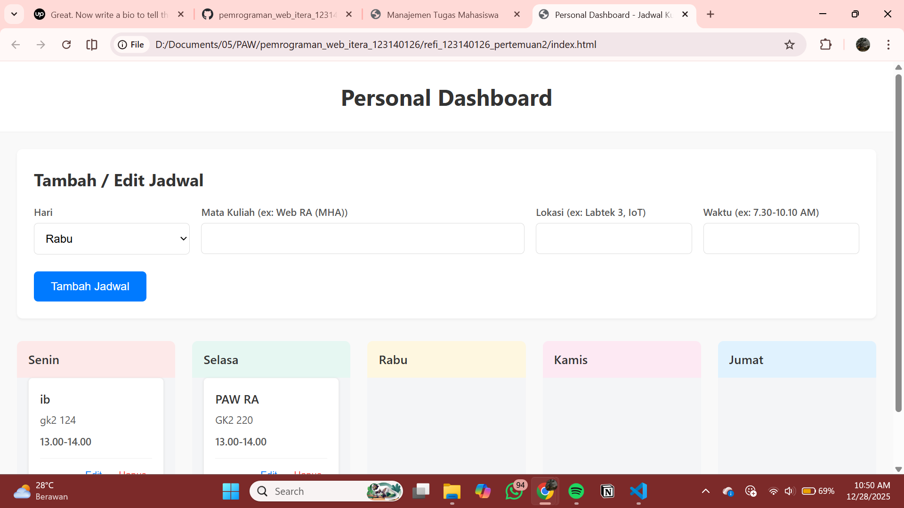

Deskripsi singkat
- Fungsi aplikasi: Eksperimen JavaScript sederhana yang menunjukkan interaksi DOM, event handling, dan manipulasi data di halaman web.
- Fitur utama: interaksi tombol, manipulasi elemen DOM, dan penggunaan fitur modern ES6+.

-  — tampilan halaman utama

Daftar fitur ES6+ yang diimplementasikan

- `let` / `const` untuk deklarasi variabel.
- Arrow functions (fungsi panah) untuk callback singkat.
- Template literals untuk membangun string HTML dinamis (`` `...${var}...` ``).
- Destructuring assignment untuk mengambil nilai dari array/object.
- Default parameters pada fungsi bila diperlukan.
- Array methods modern: `map`, `filter`, `forEach`.

Cara menjalankan

1. Buka folder `refi_123140126_pertemuan2`.
2. Buka `index.html` di browser atau jalankan server statis sederhana:

```powershell
python -m http.server 8001
# lalu buka http://localhost:8001/index.html
```