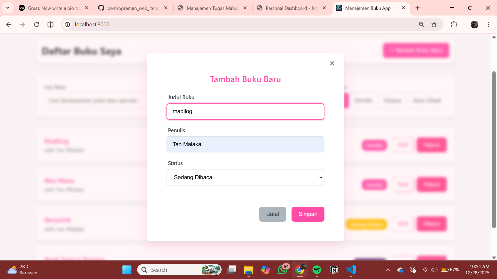
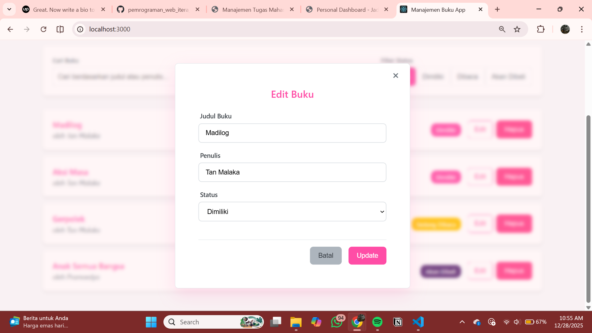
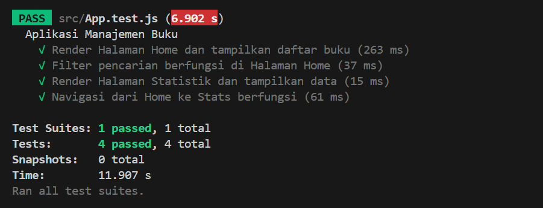

Deskripsi aplikasi

- Aplikasi single-page sederhana menggunakan React. Menampilkan komponen utama `App` dengan beberapa child component untuk demo state, props, dan event handling.

Instruksi instalasi dan menjalankan

1. Buka folder `refi_123140126_pertemuan3`.
2. Install dependensi:

```powershell
npm install
# atau jika menggunakan yarn:
yarn install
```

3. Jalankan development server:

```powershell
npm start
# atau yarn start
```

Screenshot antarmuka:

- 
- 
- 
- 

Penjelasan fitur React yang digunakan

- Functional components dan/atau class components (sebut yang dipakai).
- State management menggunakan `useState` (atau `this.state` bila class component).
- Props untuk komunikasi antar komponen.
- Event handling (onClick, onSubmit) untuk interaksi user.
- Conditional rendering untuk menampilkan elemen berdasarkan state.

Laporan testing

```powershell
npm test
# atau yarn test
```

- 
